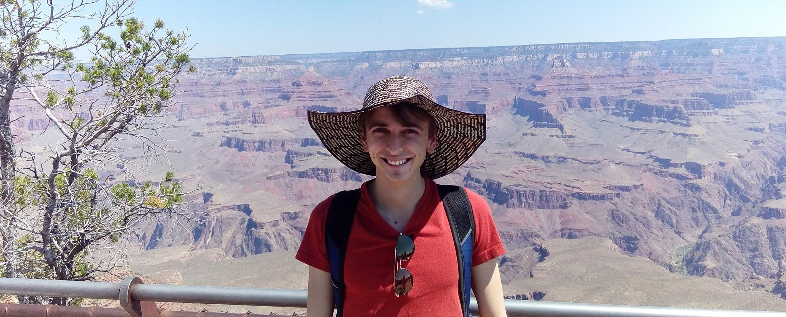

### Guillaume Jeanneret Webpage

## Summary

I am a Biomedical Engineer with a minor on Mathematics and Computer Science from the Universidad de los Andes, Bogotá, Colombia, and a Ms.c. in Biomedical Engineering from the Universidad de los Andes as well.

I have a strong basis on Mathematics and Machine Learning, spectially Deep Learning.